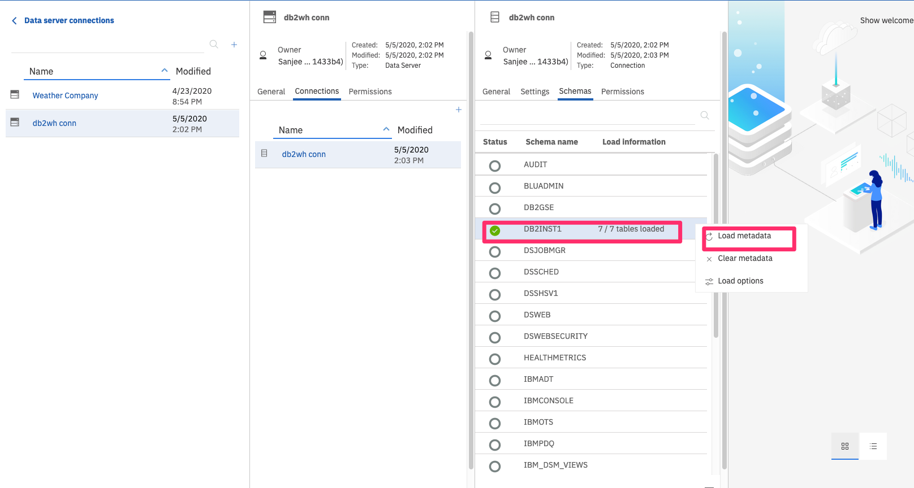
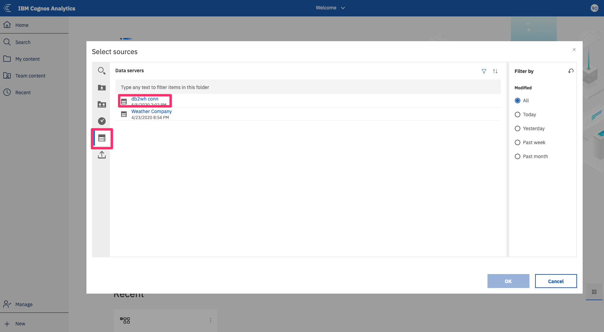
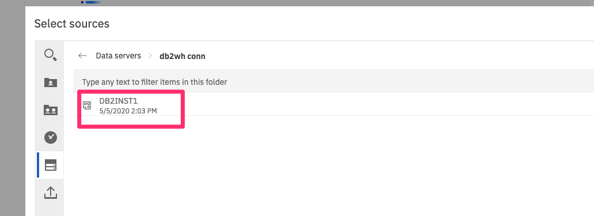
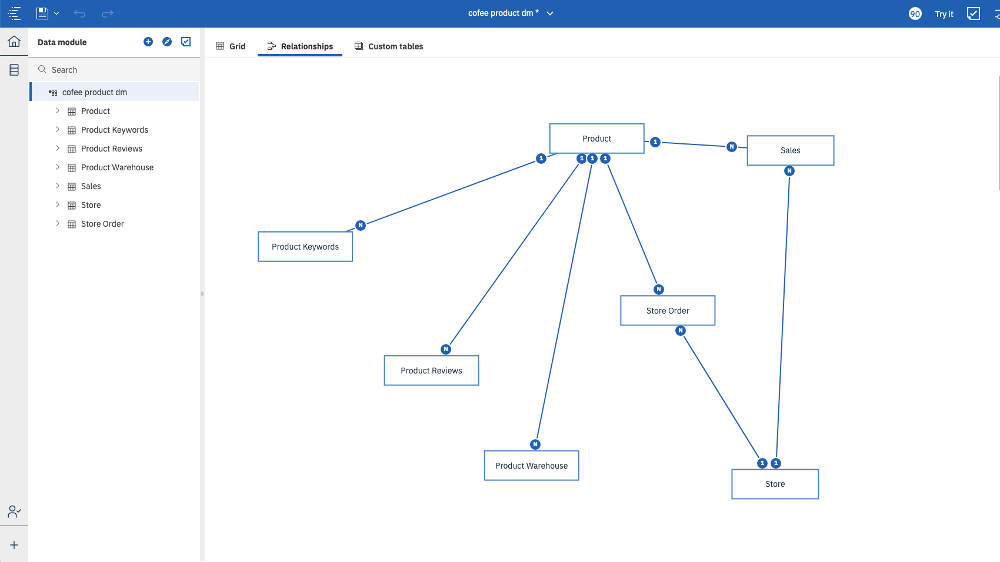
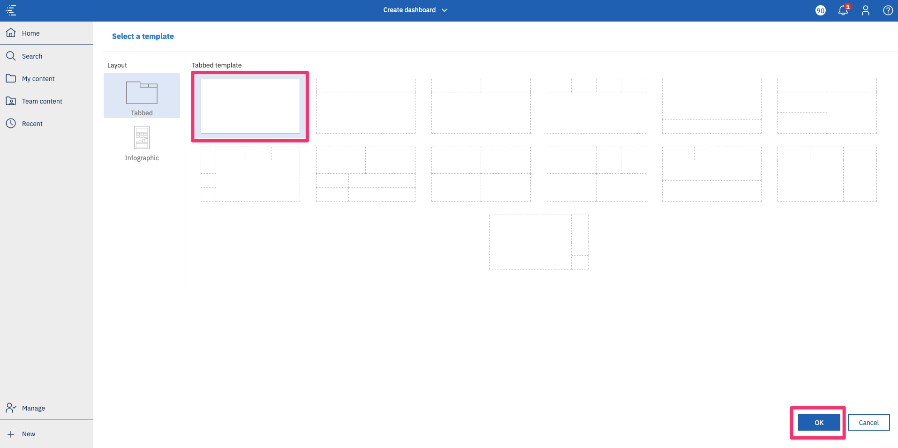
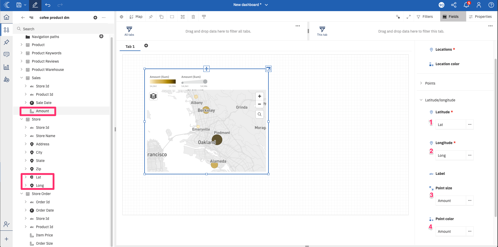

# Visualize customer insights with business data for product performance analysis

In this section, we will walk you through the process of creating sales, store and inventory data to support our coffee company products and upload these business data into Db2 Warehouse schema, then use Cognos Analytics to connect to IBM Db2 Warehouse on cloud and dynamically create additional Cognos Analytics dashboards to visualize the business data loaded from IBM Db2 Warehouse.


## Flow

1. Product and business data is loaded into Db2 Warehouse tables.
2. User runs Cognos Analytics.
3. Cognos Analytics is linked to the Db2 Warehouse instance.

## Steps

1. [Create IBM Db2 Warehouse service on IBM Cloud](#1-create-ibm-db2-warehouse-service-on-ibm-cloud)
1. [Add db2 service credentials to environment file](#2-add-db2-service-credentials-to-environment-file)
1. [Run the script to load data to the database](#3-run-the-script-to-load-data-to-the-database)
1. [Create database connection in Cognos Analytics](#4-create-database-connection-in-cognos-analytics)
1. [Load metadata from the connected Database](#5-load-metadata-from-the-connected-database)
1. [Create data module](#6-create-data-module)
1. [Create dashboard](#7-create-dashboard)
1. [Run Cognos Analytics to visualize data](#6-run-cognos-analytics-to-visualize-data)

>If you have come here without completing the first tutorial please click [here](doc/source/discovery-data.md) to begin.

## 1. Create IBM Db2 Warehouse service on IBM Cloud

Create the IBM Db2 Warehouse on Cloud service and make sure to note the credentials using the following link:

* [**IBM Db2 Warehouse on Cloud**](https://cloud.ibm.com/catalog/services/db2-warehouse)

## 2. Add db2 service credentials to environment file

At this point you must already have a `.env` file in your project directory. Change the value of `DB2wh_DSN` in the `.env` file as shown below:

```bash
DB2WH_DSN=<value of ssldsn>
```


## 3. Run the script to load data to the database

From the command prompt go to the `lib` folder in your project directory. And run the following command to load business data to IBM Db2 Warehouse on cloud:

```bash
cd lib/db/
node generate-product-business-data.js
```
This will create schema, assign relationships and load the product and sales data to the database.

## 4. Create database connection in Cognos Analytics

From the home page of Cognos Analytics, select `Manage` from the lower left corner  and click `Data Server Connections`.


Click `+` button to add new connection:


1. select `IBM Db2 Warehouse` from the list
2. Copy and paste the `ssljdbcurl` from the Db2 Warehouse service credentials that you have saved earlier in the `JDBC URL` field
3. Add username/password Credentials by selecting `Use the following sign on`.


1. Click `+` to add a new sign on.
2. Enter the username and password from the Db2 Warehouse service credentials that you have saved earlier
3. Click the `Test` link to make sure the connection is successful.
4. Give a name to your connection and click `Save`.

## 5. Load metadata from the connected Database

Once the connection is successful, you need to load the metadata from the database for ex: tables, relationships and data. Select `Schemas` from the tabs, Select the schema `DB2INST1` from the list. Click the three dots on the right and clikc `Load metadata`.



## 6. Create data module

From the home page, select `+` icon in the lower left corner. Select `Data Module`.


From the source selection panel, select the data connection that you created in `step 4`,



Select the metadata that was loaded in the next step. and click `OK`



`Select Tables` in the next dialog selection and click `Next`. You will see the all the tables and data are loaded in the left navigation bar.


Select all tables in the next screen, and click `OK`.


Then save the data module.


In this view of the data module, you can also see that all the relationships defined in the database is also pulled when you loaded the metadata. You can see that by clikcing the `Relationships` tab from the tab menu.




## 7. Create dashboard

From the home page, select `+` icon in the lower left corner. Select `Dashboard`.


Select the dashboard template or any other template that fits your need. We are going to select the empty template.



## 8. Run Cognos Analytics to visualize data

In this section we will create visualizations using the schema and data that we have loaded from IBM Db2 Warehouse.

### 1. Store locations with sales

From the visualization list select map and drag it to the canvas.


From the `Store` table, select `Lat` and `Long` and drag and drop them into `Latitude` (1) and `Longitude` (2) fields as shown in the diagram below. To also show the total sales of each store in the map, select `Amount` field from the `Sales` table and, drag and drop them to `Point size` (3) and also `Point color` (4) fields on the right navigation bar. This means that higher the sales amount bigger will be the size of the points that gets displayed in the map.

> Note: To open up the field right navigation select `Fields` from the top right corner.



To change the style of the map, select `properties` from top right corner, go to `Chart` and expand it. Select `Style` and choose `outdoors` or any that fits your purpose from the dropdown.


You can also change the point color range by 


Lets give title to the widget. To do so, select the widget and select the `Title` (1) icon from the widget menu and give it an appropriate title.

You can also change the name of the tab by selecting the tab and editing the text.


### 2. Sales by Store

From the data module, select `Store Name` (1) from `Store` table and `Sale Date` (2), `Amount` (3) from `Sales` table and drag and drop them to the canvas. To make working with the widget easier, you can maximize the widget by clicking maximize button. The chart you will see has daily store sales.


We want to show monthly store sales. To do show we need to extract months from the `Sale Date`. For this we need to add a calculation that uses the inbuilt month function `_month()`.

Create calculation by clicking the three dots on the right side of the `Sales` and click New `Calculation...`


It opens up a dialog box. 
1. In the expression text box, write the `_month` function with `SALE_DATE` as parameter to it as show in the diagram below. Or you can drag and drop `Sale Date` in between the parenthesis of `_month`.  

2. Provide a name to the calculatin as `sale_date_month`

3. You can preview the output of the expression by clicking the eye icon.


click `OK` when done.

To change the daily sales to monhtly sales you need to now use the calculation as a column. Drag the calculation and replace the `Sale Date` from the fields.


Now you will see the monthly store sales in the chart. The axis label by default is the same name as calculations or the column name used in the data module. To change the axis label, click widget `Properties` from the top right corner, select `Axis` and enter a name `Months` in `Item axis title`


### 3. Product monthly inventory

Next visualization we will create is the product monthly inventory. 

1- From the data module left navigation, select `Product Name` from `Product` table, `Item  Stock Date` and `Quanity` from `Product Warehouse` table and drag it to the canvas. You will see that by default it creates a line graph that shows monthly inventory of each product.

2- One of the feature of Cognos Analytics is to add forecasting. In this chart we can forecast inventory for next couple of months. Click the forecasting icon from the top right corner of the widget and enable the forecasting. For now we will use the default values. The dotted lines in the graph shows forecasted inventories for each product.


### 4. Product Monthly Sales

Next chart we will be creating is `Product Monthly Sales`. This will help us determine and relate the inventory which is inversely porportional to the sales.

1- Select `Product Name` from `Product` table,`Sale Date`,`Amount` from `Sales` table, drag and drop them to the empty area of the canvas.

2- You can maximize the widget while you are working on it. Select the `sale_date_month` calculation and replace the `Sale Date` from the fields. We need to do this to get the sales monthly.

3- Change the chart by select the widget menu and changing it to a `Column` chart.

4- You can change the color by selecting from the existing color pallete from the properties.

5- Also rename the `Item axis title` to `Months`.

6- Finally provide a title `Product Monthly Sales` to the widget.


### Complete and Save

Congratulations! You have now completed the creation of inventory dashboard. The final visualization should look like below:


Click the `Save` icon in the top menu to save your dashboard.

### Whats Next?
<table border="0">
  <tbody>
    <tr>
      <td align="left"><a href="https://github.com/IBM/cognos-analytics-using-unstructured-data/blob/rearrange/doc/source/discovery-data.md"></a><br/>
        <span>&nbsp;&nbsp;&nbsp;&nbsp;&nbsp;&nbsp;&nbsp;&nbsp;</span>
        <span>&nbsp;&nbsp;&nbsp;&nbsp;&nbsp;&nbsp;&nbsp;&nbsp;</span>
        <span>&nbsp;&nbsp;&nbsp;&nbsp;&nbsp;&nbsp;&nbsp;&nbsp;</span>
        <span>&nbsp;&nbsp;&nbsp;&nbsp;&nbsp;&nbsp;&nbsp;&nbsp;</span>
        <span>&nbsp;&nbsp;&nbsp;&nbsp;&nbsp;&nbsp;&nbsp;&nbsp;</span>
        <span>&nbsp;&nbsp;&nbsp;&nbsp;&nbsp;&nbsp;&nbsp;&nbsp;</span>
        <span>&nbsp;&nbsp;&nbsp;&nbsp;&nbsp;&nbsp;&nbsp;&nbsp;</span>    
        <span>&nbsp;&nbsp;</span>
      </td>
      <td align="center"><a href="https://github.com/IBM/cognos-analytics-using-unstructured-data/blob/rearrange/README.md"></a><br/>
        <span>&nbsp;&nbsp;&nbsp;&nbsp;&nbsp;&nbsp;&nbsp;&nbsp;</span>
        <span>&nbsp;&nbsp;&nbsp;&nbsp;&nbsp;&nbsp;&nbsp;&nbsp;</span>
        <span>&nbsp;&nbsp;&nbsp;&nbsp;&nbsp;&nbsp;&nbsp;&nbsp;</span>
        <span>&nbsp;&nbsp;&nbsp;&nbsp;&nbsp;&nbsp;&nbsp;&nbsp;</span>
        <span>&nbsp;&nbsp;&nbsp;&nbsp;&nbsp;&nbsp;&nbsp;&nbsp;</span>        
        <span>&nbsp;&nbsp;&nbsp;&nbsp;&nbsp;&nbsp;&nbsp;&nbsp;</span>
        <span>&nbsp;&nbsp;&nbsp;&nbsp;&nbsp;&nbsp;&nbsp;&nbsp;</span>
        <span>&nbsp;&nbsp;</span>
      </td>
      <td align="right"><a href="https://github.com/IBM/cognos-analytics-using-unstructured-data/blob/rearrange/README.md"></a><br/>
        <span>&nbsp;&nbsp;&nbsp;&nbsp;&nbsp;&nbsp;&nbsp;&nbsp;</span>
        <span>&nbsp;&nbsp;&nbsp;&nbsp;&nbsp;&nbsp;&nbsp;&nbsp;</span>
        <span>&nbsp;&nbsp;&nbsp;&nbsp;&nbsp;&nbsp;&nbsp;&nbsp;</span>
        <span>&nbsp;&nbsp;&nbsp;&nbsp;&nbsp;&nbsp;&nbsp;&nbsp;</span>    
        <span>&nbsp;&nbsp;&nbsp;&nbsp;&nbsp;&nbsp;&nbsp;&nbsp;</span>
        <span>&nbsp;&nbsp;&nbsp;&nbsp;&nbsp;&nbsp;&nbsp;&nbsp;</span>
        <span>&nbsp;&nbsp;&nbsp;&nbsp;&nbsp;&nbsp;&nbsp;&nbsp;</span>     
        <span>&nbsp;&nbsp;</span>        
      </td>
    </tr>
  </tbody>
</table>
